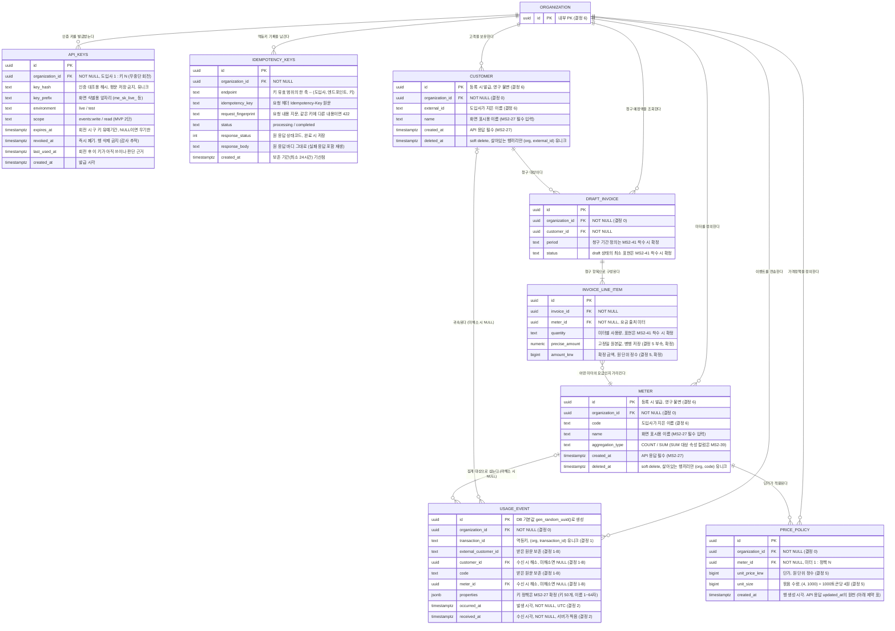

# S1 ERD v2 (MS2-26)

- 작성: 2026-07-29, 문인호 / 개정: 2026-07-30
- 버전: v2.1 / 반영 범위: 슬라이스 1 (MS2-36 코어 파이프라인) + MS2-27 API 명세 v1(PR #9) 역반영 + PR #13 리뷰 반영(복합 FK 테넌트 격리, DELETE/TRUNCATE 트리거 차단)
- 지위: living document. 이후 슬라이스에서 엔티티가 추가되면 버전을 올린다
- 전제: 불변 결정 목록 확정본(정본은 Notion 팀 위키, 2026-07-29 데일리 비준)의 결정 0~7 + `docs/api/openapi.yaml` (MS2-27, PR #9). 재논의 없이 두 문서를 근거로 참조한다
- 자료형은 PostgreSQL 기준이다 (ADR 0002 승인). 권한 메커니즘(롤 분리)의 담당 스토리는 미정이다 (PR #11의 개발 환경은 단일 계정 구성)
- 이 문서의 S1 확정분은 V1 마이그레이션(`backend/src/main/resources/db/migration/V1__create_s1_core_tables.sql`)으로 DB에 반영된다
- 표기 도구: 지금은 mermaid 텍스트로 작성한다. 제안 문서의 tbls는 실제 DB에서 생성하는 도구라, MS2-31로 DB가 생긴 뒤 자동 생성으로 전환한다

## 엔티티 6종 (결정 0) + 지원 테이블 2종 (MS2-27)

도입사(Organization), 고객, 미터, 사용량 이벤트, 가격정책, draft 인보이스(+라인아이템).
사업자(BillingEntity)는 S1 제외 -- 인보이스 채번(gap-free 연번)이 붙는 자리이므로 후속 슬라이스에서 DRAFT_INVOICE 옆에 추가된다 (확장 메모).

v2에서 MS2-27 인증/멱등 규약이 요구하는 지원 테이블 2종(API_KEYS, IDEMPOTENCY_KEYS)이 추가됐다. 도메인 엔티티가 아니라 API 계약을 DB가 뒷받침하는 테이블이며, 결정 0의 엔티티 6종 프레임은 유지된다.

### 각 테이블의 역할

| 테이블 | 역할 |
|---|---|
| ORGANIZATION | MeterEngine을 도입한 회사 (테넌트). 모든 데이터 격리의 기준이며, API 키 인증으로 확정된 도입사 스코프 안에서만 조회와 저장이 일어난다 |
| API_KEYS | 도입사 인증 키. Bearer 키의 해시를 보관하며 키가 도입사를 식별한다. 무중단 회전(구 키와 신 키가 동시에 유효한 기간)을 위해 도입사 1 : 키 N (MS2-27) |
| IDEMPOTENCY_KEYS | 제어면 멱등키 기록. 키, 요청 지문, 원 응답 스냅샷, 처리 상태를 보관해 같은 키의 재전송에 원 응답을 재생한다 (MS2-27 공통 규약 4.2) |
| CUSTOMER | 도입사의 고객, 즉 청구 대상. 사용량과 인보이스가 귀속되는 단위. 도입사가 지은 이름(external_id)과 우리가 발급한 번호(id)를 함께 가진다 |
| METER | 이벤트를 청구 가능한 숫자 하나로 만드는 집계 규칙. "호출 횟수를 센다(COUNT)" 또는 "토큰 수를 더한다(SUM)" 같은 계산 방법을 code라는 이름표로 등록해 둔다 |
| USAGE_EVENT | 도입사가 보내온 raw 사용량 기록. 모든 청구 금액의 유일한 근거이며, 한 번 저장되면 고치거나 지울 수 없다 (append-only). 사용량은 이 줄들을 조회 시점에 합산한 파생물이다 |
| PRICE_POLICY | 미터별 가격표. "1,000토큰당 4원" 같은 단가를 (단가, 묶음 수량) 쌍으로 담고, 집계값에 곱해져 요금이 된다 |
| DRAFT_INVOICE | 고객별 청구 예정액 (청구서 초안). 확정 전이라 언제든 재계산 가능한 파생물이며, 요금 설정 검증과 고객 문의 대응에 쓴다. 테이블로 저장할지는 MS2-41 착수 시 결정 |
| INVOICE_LINE_ITEM | 청구서 안의 미터별 항목 줄 (영수증의 품목 한 줄). 어떤 미터의 사용량이 얼마이고 요금이 얼마인지 담는다. 고정밀 원본값과 확정 금액을 병행 저장한다 |

## ERD

DRAFT_INVOICE와 INVOICE_LINE_ITEM은 엔티티와 관계만 S1 범위이고, 테이블 정의(컬럼 확정)는 MS2-41 착수 시 한다. 위 다이어그램에서 "MS2-41 착수 시 확정"이 붙은 속성은 자리 표시이며, 확정된 것은 precise_amount와 amount_krw 병행 저장뿐이다.

## mermaid로 표현하지 못한 제약 (V1 마이그레이션과 세트로 읽는다)

| 대상 | 제약 | 근거 |
|---|---|---|
| USAGE_EVENT | `UNIQUE (organization_id, transaction_id)` -- 무기한 유일, 기간 윈도우 없음 | 결정 1 |
| USAGE_EVENT.transaction_id | `CHECK (transaction_id <> '' AND length <= 255)`, 바이트 단위 정확 일치, 서버는 해석/정규화하지 않음 | 결정 1 부속 |
| USAGE_EVENT | append-only: 가드 트리거가 UPDATE(허용 예외는 아래 행)와 DELETE/TRUNCATE를 전면 차단한다. 롤 분리(담당 스토리 미정)는 추가 방어. 수동 정리는 소유자가 트리거를 잠시 해제 후 삭제, 재활성화하고 기록한다 (PR #13 리뷰로 "롤 권한으로만 차단"에서 변경) | 결정 3 |
| USAGE_EVENT.customer_id, meter_id | 예외적으로 NULL -> 값 1회 채움만 허용: 컬럼 단위 UPDATE 권한 + 가드 트리거 | 결정 1-B 재연결 |
| USAGE_EVENT.customer_id, meter_id | 복합 FK `(organization_id, customer_id/meter_id)`로 같은 도입사 소속만 참조 가능 (테넌트 교차 참조 차단). NULL이면 검사를 건너뛰어 미해소 이벤트 저장에 영향 없음 | 결정 0 확장, PR #13 리뷰 |
| PRICE_POLICY.meter_id | 복합 FK `(organization_id, meter_id)`로 같은 도입사의 미터만 참조 가능 | 결정 0 확장, PR #13 리뷰 |
| CUSTOMER, METER | `UNIQUE (organization_id, id)` -- 위 복합 FK의 참조 대상 (id가 PK라 유일성은 자명, FK 형식 요건) | PR #13 리뷰 |
| USAGE_EVENT.received_at | 서버가 찍는다 (`clock_timestamp()`), 클라이언트 입력 불가 | 결정 2 |
| 모든 테이블 id | DB 기본값 `gen_random_uuid()`로 생성 (앱 생성 아님). 스택 중립이고 DB가 방어선이라는 원칙과 정합. 가역 결정 -- 삽입 성능 이슈가 실측되면 UUIDv7 계열로 전환 검토 | 확정본 부록 위임, 2026-07-29 결정 |
| CUSTOMER | `UNIQUE (organization_id, external_id) WHERE deleted_at IS NULL` -- 부분 유니크로 이름 재사용 허용 | 결정 6 |
| METER | `UNIQUE (organization_id, code) WHERE deleted_at IS NULL` | 결정 6 |
| METER.aggregation_type | `CHECK (IN ('COUNT', 'SUM'))` -- 확정본에 명시된 두 종류만 DB에서 허용. 집계 방식 추가는 가산적 | MS2-39 인수 조건 |
| PRICE_POLICY | `CHECK (unit_price_krw >= 0)`, `CHECK (unit_size >= 1)` -- 음수 단가와 0 나누기 방어. 확정본에 없는 초안 추가 제약 | 방어 제약 (초안) |
| PRICE_POLICY | 단가 변경은 이력이 남아야 한다 (이력 없는 덮어쓰기 금지). 버전 row vs 이력 테이블은 MS2-40 | 결정 7 |
| PRICE_POLICY.created_at | 행은 불변이고 수정은 새 행 추가로만 하므로(결정 7) 갱신 시각이 아니라 생성 시각을 둔다. API 응답의 `updated_at`은 현재 유효 행의 created_at으로 채운다 | 결정 7 정합, MS2-27 |
| PRICE_POLICY | 확장 여지 메모: graduated/volume 등 가격 모델 타입 필드는 후속 슬라이스에서 추가 (S1은 per-unit뿐) | 스프린트2 제안 |
| API_KEYS | `UNIQUE (key_hash)`. 행 삭제 금지 -- 폐기는 revoked_at 기록으로 (어느 키로 들어온 요청인지 감사 추적) | MS2-27 |
| API_KEYS.key_hash | 평문 저장 금지. 키는 발급 시 1회만 표시되고 이후 조회 불가, 서버는 해시만 보관 | MS2-27 |
| API_KEYS.environment, scope | `CHECK (environment IN ('live', 'test'))`, `CHECK (scope IN ('events:write', 'read'))` | MS2-27 |
| IDEMPOTENCY_KEYS | `UNIQUE (organization_id, endpoint, idempotency_key)` -- 키 유효 범위는 (도입사, 엔드포인트, 키) | MS2-27 공통 규약 4.2 |
| IDEMPOTENCY_KEYS | 최소 24시간 보존, 이후 삭제 가능 (보존 만료 후 같은 키는 새 요청으로 처리). 만료 행 정리 방식은 미정 (담당 스토리 확정 필요) | MS2-27 공통 규약 4.2 |
| IDEMPOTENCY_KEYS.response_body | 원 응답을 바이트 그대로 재생해야 하므로 재직렬화가 생기는 jsonb가 아니라 text로 둔다 (초안) | MS2-27 "원 응답 재생" |
| 시각 전반 | UTC 저장, 귀속/표시 경계는 KST 자정, 계산 기준은 occurred_at | 결정 2 |

## MS2-27이 정의했지만 v2에 반영하지 않은 것 (의도된 제외, 2026-07-30 합의)

| 항목 | 제외 이유 |
|---|---|
| CUSTOMER.currency, PRICE_POLICY의 model/currency | API 계약 필드지만 S1은 고정값(KRW, per_unit)이라 컬럼 정보량이 0이다. 컬럼 추가는 가산적이므로 다통화/다모델 슬라이스에서 기본값을 채우며 추가한다. 그 전까지 API 응답은 상수로 처리 |
| METER의 SUM 대상 속성 컬럼 | API 표면은 MS2-27이 `field_name` 필수 입력으로 확정했으나, DB 컬럼명과 제약은 MS2-39 담당이 명세와 테이블을 함께 확정한다 (이관 유지). 전제: SUM 미터 생성 기능이 MS2-39보다 먼저 구현되지 않는다 |
| 환경(live/test) 데이터 격리 | api_keys.environment만으로는 test 키로 보낸 이벤트가 운영 집계에 섞인다. 명세와 ERD 공통의 알려진 공백으로 두며, test 키를 처음 발급하기 전에 반드시 재논의한다 |

## 이 ERD에서 각 스토리가 이어받아 결정할 것 (누락이 아니라 이관)

결정/명세 스토리:

| 스토리 | 상태 |
|---|---|
| MS2-27 API 명세 | **PR #9로 확정, v2에 역반영 완료.** 확정 내용: properties 키 정책(키 50개, 이름 1~64자, 값은 문자열/숫자/불리언/null, 중첩은 저장하되 집계 제외), 중복 재전송 201(신규)/200(기존 반환), 시각 입력 RFC 3339(과거 무제한, 미래 5분), api_keys 테이블 요구사항 |
| MS2-28 ADR | 자료형과 권한 메커니즘 최종 확정 (이 문서는 PostgreSQL 기준 초안) |
| MS2-31 환경 구축 | PR #11로 완료됐으나 단일 계정 구성이라 롤 분리(app_role, 운영 롤)는 실행되지 않았다. 롤 분리와 idempotency_keys 만료 행 정리의 담당 스토리는 미정 -- 데일리에서 확정 필요. V1 마이그레이션의 REVOKE/GRANT 주석 블록이 그 시점의 할 일 |

구현 스토리 (MS2-38~41, 46):

| 스토리 | 이 ERD와의 관계, 착수 시 결정할 것 |
|---|---|
| MS2-38 수집 | **추가 결정 없음.** usage_events 정의는 이 ERD로 완결 -- 스키마, 유니크 제약, 가드 트리거는 V1 마이그레이션에 반영되어 있다. 응답 코드와 요청 형식은 MS2-27 규약(확정)을 따른다 |
| MS2-39 집계 | SUM의 대상 속성 컬럼 (API 표면은 MS2-27이 field_name으로 확정, meters의 컬럼명/제약은 여기서 명세와 함께 확정), 미터 버전화 여부, 집계 반영 지연 목표치와 월 귀속 상세 규칙 (KST 경계 자체는 확정), 집계 조회용 인덱스 (미해소 건수 조회 포함 -- MS2-27이 확정한 원문 귀속 쿼리 패턴 참조) |
| MS2-40 요금 | 가격정책 이력 구조 (버전제 vs 이력 테이블 -- 버전제면 price_policies가 다중 row 구조로 바뀜), 단수 규칙 선택 (절사/반올림, 적용 지점 -- 확정본 결정 5 부속의 분석 활용), 가격 soft delete 표현 |
| MS2-41 인보이스 | draft를 테이블로 저장할지 조회 시 계산만 할지, 청구 기간 정의와 표현, draft 상태의 최소 표현, 라인아이템 사용량(quantity) 타입 (MS2-39 결과에 의존), 가격 근거 기록 컬럼 (MS2-40 결과에 의존). 저장하기로 하면 이 문서의 자리 표시 엔티티(DRAFT_INVOICE, INVOICE_LINE_ITEM)에서 출발 -- precise_amount, amount_krw 병행 저장은 확정분이라 재논의 불가 |
| MS2-46 화면 | **추가 결정 없음.** 조회 전용이고 S1 API만 호출한다. 미해소 이벤트 건수는 MS2-27이 집계 조회 응답의 unresolved_events_count로 확정했다 (이 ERD의 customer_id/meter_id NULL 설계가 근거) |

## 개정 이력

| 버전 | 날짜 | 내용 |
|---|---|---|
| v1 | 2026-07-29 | S1 범위 최초 작성 (불변결정목록 확정본 기준) |
| v2 | 2026-07-30 | MS2-27 API 명세 v1(PR #9) 역반영: api_keys, idempotency_keys 테이블 추가, customers/meters에 name과 created_at, price_policies에 created_at 추가, MS2-27 이관 항목 확정 상태 갱신, 의도된 제외 3건 기록. 같은 날 레포 `docs/erd/`로 이관하고 V1 마이그레이션과 동기화 |
| v2.1 | 2026-07-30 | PR #13 리뷰 반영: customer_id/meter_id 참조를 복합 FK로 교체해 테넌트 교차 참조를 DB에서 차단, usage_events DELETE/TRUNCATE를 트리거로 차단(롤 권한은 추가 방어로 변경) |
