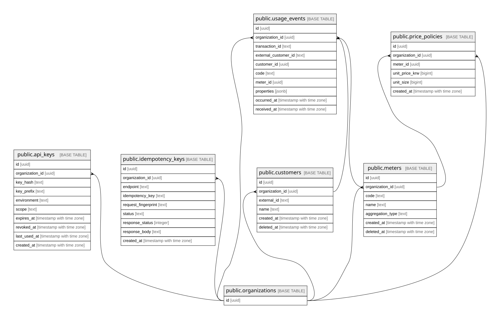

# meterengine

## Tables

| Name | Columns | Comment | Type |
| ---- | ------- | ------- | ---- |
| [public.organizations](public.organizations.md) | 1 | 도입사. 모든 테넌트 스코프 테이블이 organization_id로 이 테이블을 참조한다 (결정 0) | BASE TABLE |
| [public.api_keys](public.api_keys.md) | 10 | Bearer 인증 키. 무중단 회전을 위해 도입사 1 : 키 N (organizations의 컬럼이면 회전 불가) | BASE TABLE |
| [public.idempotency_keys](public.idempotency_keys.md) | 9 | 제어면 멱등키 처리 기록. 보존 최소 24시간 (MS2-27 공통 규약 4.2) | BASE TABLE |
| [public.customers](public.customers.md) | 6 | 고객. soft delete 후 external_id 재사용을 허용한다 (결정 6) | BASE TABLE |
| [public.meters](public.meters.md) | 7 | 미터. 이벤트가 code를 실어 집계 규칙을 지목한다 (결정 6) | BASE TABLE |
| [public.price_policies](public.price_policies.md) | 6 | 가격정책. 단가 변경은 이력이 남아야 한다. 이력 없는 덮어쓰기 금지 (결정 7) | BASE TABLE |
| [public.usage_events](public.usage_events.md) | 10 | raw 청구 근거. append-only이며 가드 트리거로 DB가 강제한다 (결정 3) | BASE TABLE |

## Stored procedures and functions

| Name | ReturnType | Arguments | Type |
| ---- | ------- | ------- | ---- |
| public.usage_events_set_received_at | trigger |  | FUNCTION |
| public.usage_events_guard_update | trigger |  | FUNCTION |
| public.usage_events_guard_delete | trigger |  | FUNCTION |

## Relations

---

> Generated by [tbls](https://github.com/k1LoW/tbls)
