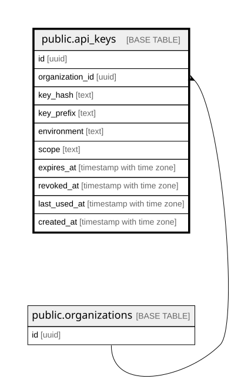

# public.api_keys

## Description

Bearer 인증 키. 무중단 회전을 위해 도입사 1 : 키 N (organizations의 컬럼이면 회전 불가)

## Columns

| Name | Type | Default | Nullable | Parents | Comment |
| ---- | ---- | ------- | -------- | ------- | ------- |
| id | uuid | gen_random_uuid() | false |  |  |
| organization_id | uuid |  | false | [public.organizations](public.organizations.md) |  |
| key_hash | text |  | false |  | 평문 저장 금지. 발급 시 1회만 표시하고 서버는 해시만 보관 |
| key_prefix | text |  | false |  | 화면 식별용 앞자리 (me_sk_live_ 등) |
| environment | text |  | false |  |  |
| scope | text |  | false |  |  |
| expires_at | timestamp with time zone |  | true |  | 회전 시 구 키 유예기간. NULL이면 무기한 |
| revoked_at | timestamp with time zone |  | true |  | 즉시 폐기. 행 삭제 대신 이 값을 기록한다 (감사 추적) |
| last_used_at | timestamp with time zone |  | true |  | 회전 후 구 키가 아직 쓰이는지 판단하는 근거 |
| created_at | timestamp with time zone | now() | false |  |  |

## Constraints

| Name | Type | Definition |
| ---- | ---- | ---------- |
| api_keys_created_at_not_null | n | NOT NULL created_at |
| api_keys_environment_check | CHECK | CHECK ((environment = ANY (ARRAY['live'::text, 'test'::text]))) |
| api_keys_environment_not_null | n | NOT NULL environment |
| api_keys_id_not_null | n | NOT NULL id |
| api_keys_key_hash_not_null | n | NOT NULL key_hash |
| api_keys_key_prefix_not_null | n | NOT NULL key_prefix |
| api_keys_organization_id_not_null | n | NOT NULL organization_id |
| api_keys_scope_check | CHECK | CHECK ((scope = ANY (ARRAY['events:write'::text, 'read'::text]))) |
| api_keys_scope_not_null | n | NOT NULL scope |
| api_keys_organization_id_fkey | FOREIGN KEY | FOREIGN KEY (organization_id) REFERENCES organizations(id) |
| api_keys_pkey | PRIMARY KEY | PRIMARY KEY (id) |
| api_keys_key_hash_key | UNIQUE | UNIQUE (key_hash) |

## Indexes

| Name | Definition |
| ---- | ---------- |
| api_keys_pkey | CREATE UNIQUE INDEX api_keys_pkey ON public.api_keys USING btree (id) |
| api_keys_key_hash_key | CREATE UNIQUE INDEX api_keys_key_hash_key ON public.api_keys USING btree (key_hash) |

## Relations

---

> Generated by [tbls](https://github.com/k1LoW/tbls)
