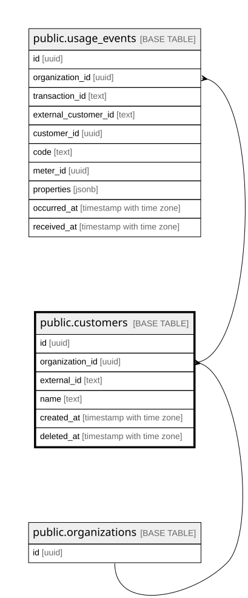

# public.customers

## Description

고객. soft delete 후 external_id 재사용을 허용한다 (결정 6)

## Columns

| Name | Type | Default | Nullable | Children | Parents | Comment |
| ---- | ---- | ------- | -------- | -------- | ------- | ------- |
| id | uuid | gen_random_uuid() | false | [public.usage_events](public.usage_events.md) |  |  |
| organization_id | uuid |  | false | [public.usage_events](public.usage_events.md) | [public.organizations](public.organizations.md) |  |
| external_id | text |  | false |  |  | 도입사가 지은 이름. 살아있는 행끼리만 유일 |
| name | text |  | false |  |  |  |
| created_at | timestamp with time zone | now() | false |  |  |  |
| deleted_at | timestamp with time zone |  | true |  |  | soft delete. 과거 이벤트의 귀속은 id(UUID)에 고정되므로 이름을 재사용해도 안전하다 (결정 1-B) |

## Constraints

| Name | Type | Definition | Comment |
| ---- | ---- | ---------- | ------- |
| customers_created_at_not_null | n | NOT NULL created_at |  |
| customers_external_id_not_null | n | NOT NULL external_id |  |
| customers_id_not_null | n | NOT NULL id |  |
| customers_name_not_null | n | NOT NULL name |  |
| customers_organization_id_not_null | n | NOT NULL organization_id |  |
| customers_organization_id_fkey | FOREIGN KEY | FOREIGN KEY (organization_id) REFERENCES organizations(id) |  |
| customers_pkey | PRIMARY KEY | PRIMARY KEY (id) |  |
| customers_org_id_unique | UNIQUE | UNIQUE (organization_id, id) | 복합 FK 참조 대상. id가 PK라 유일성은 자명하고 FK가 참조하려면 형식상 필요하다 (PR #13 리뷰) |

## Indexes

| Name | Definition | Comment |
| ---- | ---------- | ------- |
| customers_pkey | CREATE UNIQUE INDEX customers_pkey ON public.customers USING btree (id) |  |
| customers_org_id_unique | CREATE UNIQUE INDEX customers_org_id_unique ON public.customers USING btree (organization_id, id) |  |
| customers_org_external_id_alive | CREATE UNIQUE INDEX customers_org_external_id_alive ON public.customers USING btree (organization_id, external_id) WHERE (deleted_at IS NULL) | 부분 유니크: 살아있는 행끼리만 external_id가 유일하다 |

## Relations

---

> Generated by [tbls](https://github.com/k1LoW/tbls)
