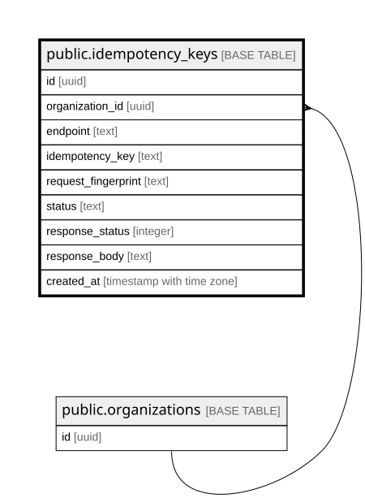

# public.idempotency_keys

## Description

제어면 멱등키 처리 기록. 보존 최소 24시간 (MS2-27 공통 규약 4.2)

## Columns

| Name | Type | Default | Nullable | Parents | Comment |
| ---- | ---- | ------- | -------- | ------- | ------- |
| id | uuid | gen_random_uuid() | false |  |  |
| organization_id | uuid |  | false | [public.organizations](public.organizations.md) |  |
| endpoint | text |  | false |  |  |
| idempotency_key | text |  | false |  |  |
| request_fingerprint | text |  | false |  | 같은 키에 다른 내용이면 422 idempotency_key_reuse |
| status | text |  | false |  |  |
| response_status | integer |  | true |  |  |
| response_body | text |  | true |  | 원 응답을 바이트 그대로 재생해야 하므로 재직렬화가 생기는 JSONB를 쓰지 않는다 |
| created_at | timestamp with time zone | now() | false |  |  |

## Constraints

| Name | Type | Definition | Comment |
| ---- | ---- | ---------- | ------- |
| idempotency_keys_completed_has_response | CHECK | CHECK (((status <> 'completed'::text) OR ((response_status IS NOT NULL) AND (response_body IS NOT NULL)))) | 완료 행은 재생할 응답을 반드시 가진다 |
| idempotency_keys_created_at_not_null | n | NOT NULL created_at |  |
| idempotency_keys_endpoint_not_null | n | NOT NULL endpoint |  |
| idempotency_keys_id_not_null | n | NOT NULL id |  |
| idempotency_keys_idempotency_key_check | CHECK | CHECK (((idempotency_key <> ''::text) AND (length(idempotency_key) <= 255))) |  |
| idempotency_keys_idempotency_key_not_null | n | NOT NULL idempotency_key |  |
| idempotency_keys_organization_id_not_null | n | NOT NULL organization_id |  |
| idempotency_keys_request_fingerprint_not_null | n | NOT NULL request_fingerprint |  |
| idempotency_keys_status_check | CHECK | CHECK ((status = ANY (ARRAY['processing'::text, 'completed'::text]))) |  |
| idempotency_keys_status_not_null | n | NOT NULL status |  |
| idempotency_keys_organization_id_fkey | FOREIGN KEY | FOREIGN KEY (organization_id) REFERENCES organizations(id) |  |
| idempotency_keys_pkey | PRIMARY KEY | PRIMARY KEY (id) |  |
| idempotency_keys_scope_unique | UNIQUE | UNIQUE (organization_id, endpoint, idempotency_key) | 키 유효 범위는 (도입사, 엔드포인트, 키). 엔드포인트가 다르면 서로 간섭하지 않는다 |

## Indexes

| Name | Definition |
| ---- | ---------- |
| idempotency_keys_pkey | CREATE UNIQUE INDEX idempotency_keys_pkey ON public.idempotency_keys USING btree (id) |
| idempotency_keys_scope_unique | CREATE UNIQUE INDEX idempotency_keys_scope_unique ON public.idempotency_keys USING btree (organization_id, endpoint, idempotency_key) |

## Relations

---

> Generated by [tbls](https://github.com/k1LoW/tbls)
