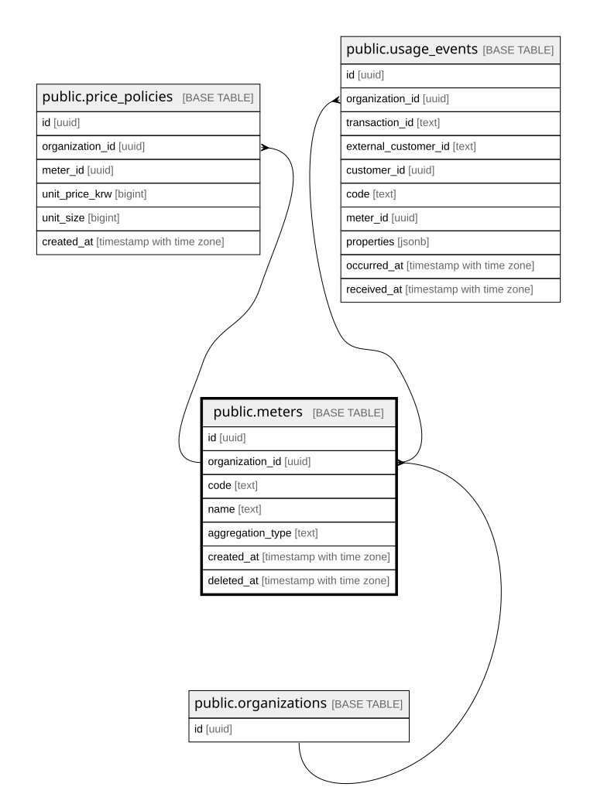

# public.meters

## Description

미터. 이벤트가 code를 실어 집계 규칙을 지목한다 (결정 6)

## Columns

| Name | Type | Default | Nullable | Children | Parents | Comment |
| ---- | ---- | ------- | -------- | -------- | ------- | ------- |
| id | uuid | gen_random_uuid() | false | [public.price_policies](public.price_policies.md) [public.usage_events](public.usage_events.md) |  |  |
| organization_id | uuid |  | false | [public.price_policies](public.price_policies.md) [public.usage_events](public.usage_events.md) | [public.organizations](public.organizations.md) |  |
| code | text |  | false |  |  | 도입사가 지은 카탈로그 이름표. 살아있는 행끼리만 유일 |
| name | text |  | false |  |  |  |
| aggregation_type | text |  | false |  |  | SUM 대상 속성 컬럼과 미터 버전화 여부는 MS2-39에서 확정한다 |
| created_at | timestamp with time zone | now() | false |  |  |  |
| deleted_at | timestamp with time zone |  | true |  |  | soft delete. 과거 이벤트의 귀속은 id(UUID)에 고정되므로 이름을 재사용해도 안전하다 (결정 1-B) |

## Constraints

| Name | Type | Definition | Comment |
| ---- | ---- | ---------- | ------- |
| meters_aggregation_type_check | CHECK | CHECK ((aggregation_type = ANY (ARRAY['COUNT'::text, 'SUM'::text]))) |  |
| meters_aggregation_type_not_null | n | NOT NULL aggregation_type |  |
| meters_code_not_null | n | NOT NULL code |  |
| meters_created_at_not_null | n | NOT NULL created_at |  |
| meters_id_not_null | n | NOT NULL id |  |
| meters_name_not_null | n | NOT NULL name |  |
| meters_organization_id_not_null | n | NOT NULL organization_id |  |
| meters_organization_id_fkey | FOREIGN KEY | FOREIGN KEY (organization_id) REFERENCES organizations(id) |  |
| meters_pkey | PRIMARY KEY | PRIMARY KEY (id) |  |
| meters_org_id_unique | UNIQUE | UNIQUE (organization_id, id) | 복합 FK 참조 대상 (customers의 같은 제약 참조, PR #13 리뷰) |

## Indexes

| Name | Definition | Comment |
| ---- | ---------- | ------- |
| meters_pkey | CREATE UNIQUE INDEX meters_pkey ON public.meters USING btree (id) |  |
| meters_org_id_unique | CREATE UNIQUE INDEX meters_org_id_unique ON public.meters USING btree (organization_id, id) |  |
| meters_org_code_alive | CREATE UNIQUE INDEX meters_org_code_alive ON public.meters USING btree (organization_id, code) WHERE (deleted_at IS NULL) | 부분 유니크: 살아있는 행끼리만 code가 유일하다 |

## Relations

---

> Generated by [tbls](https://github.com/k1LoW/tbls)
