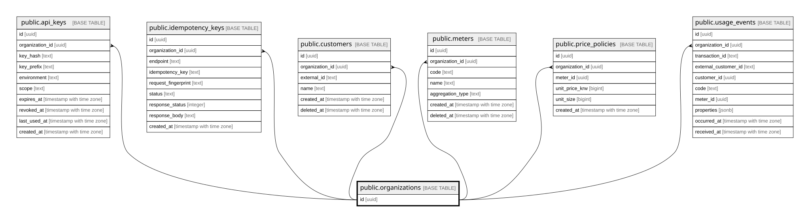

# public.organizations

## Description

도입사. 모든 테넌트 스코프 테이블이 organization_id로 이 테이블을 참조한다 (결정 0)

## Columns

| Name | Type | Default | Nullable | Children | Parents | Comment |
| ---- | ---- | ------- | -------- | -------- | ------- | ------- |
| id | uuid | gen_random_uuid() | false | [public.api_keys](public.api_keys.md) [public.idempotency_keys](public.idempotency_keys.md) [public.customers](public.customers.md) [public.meters](public.meters.md) [public.price_policies](public.price_policies.md) [public.usage_events](public.usage_events.md) |  |  |

## Constraints

| Name | Type | Definition |
| ---- | ---- | ---------- |
| organizations_id_not_null | n | NOT NULL id |
| organizations_pkey | PRIMARY KEY | PRIMARY KEY (id) |

## Indexes

| Name | Definition |
| ---- | ---------- |
| organizations_pkey | CREATE UNIQUE INDEX organizations_pkey ON public.organizations USING btree (id) |

## Relations

---

> Generated by [tbls](https://github.com/k1LoW/tbls)
