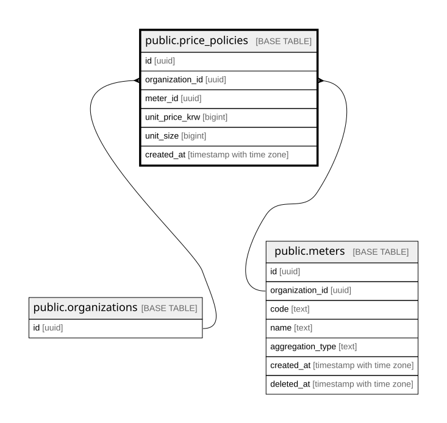

# public.price_policies

## Description

가격정책. 단가 변경은 이력이 남아야 한다. 이력 없는 덮어쓰기 금지 (결정 7)

## Columns

| Name | Type | Default | Nullable | Parents | Comment |
| ---- | ---- | ------- | -------- | ------- | ------- |
| id | uuid | gen_random_uuid() | false |  |  |
| organization_id | uuid |  | false | [public.organizations](public.organizations.md) [public.meters](public.meters.md) |  |
| meter_id | uuid |  | false | [public.meters](public.meters.md) |  |
| unit_price_krw | bigint |  | false |  | 묶음 수량당 단가. 1,000토큰당 4원이면 (4, 1000) |
| unit_size | bigint | 1 | false |  | 묶음 수량. per-unit은 unit_size = 1의 특수 케이스 |
| created_at | timestamp with time zone | now() | false |  | 행이 불변이므로 갱신 시각이 아니라 생성 시각 |

## Constraints

| Name | Type | Definition | Comment |
| ---- | ---- | ---------- | ------- |
| price_policies_created_at_not_null | n | NOT NULL created_at |  |
| price_policies_id_not_null | n | NOT NULL id |  |
| price_policies_meter_id_not_null | n | NOT NULL meter_id |  |
| price_policies_organization_id_not_null | n | NOT NULL organization_id |  |
| price_policies_unit_price_krw_check | CHECK | CHECK ((unit_price_krw >= 0)) |  |
| price_policies_unit_price_krw_not_null | n | NOT NULL unit_price_krw |  |
| price_policies_unit_size_check | CHECK | CHECK ((unit_size >= 1)) |  |
| price_policies_unit_size_not_null | n | NOT NULL unit_size |  |
| price_policies_organization_id_fkey | FOREIGN KEY | FOREIGN KEY (organization_id) REFERENCES organizations(id) |  |
| price_policies_meter_same_org | FOREIGN KEY | FOREIGN KEY (organization_id, meter_id) REFERENCES meters(organization_id, id) | 다른 도입사의 미터에 가격정책이 붙는 것을 DB가 차단한다 (PR #13 리뷰) |
| price_policies_pkey | PRIMARY KEY | PRIMARY KEY (id) |  |

## Indexes

| Name | Definition |
| ---- | ---------- |
| price_policies_pkey | CREATE UNIQUE INDEX price_policies_pkey ON public.price_policies USING btree (id) |

## Relations

---

> Generated by [tbls](https://github.com/k1LoW/tbls)
