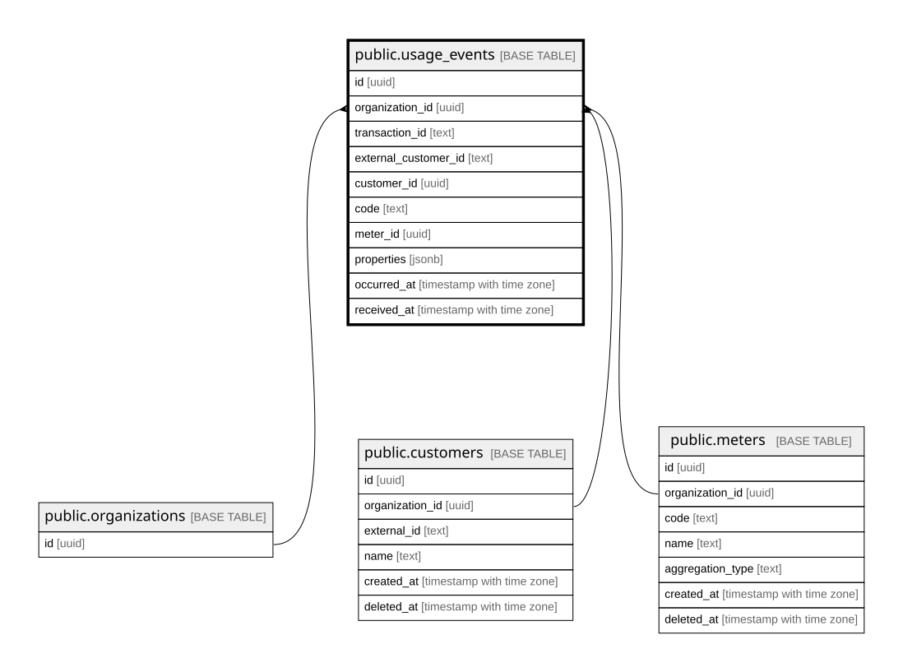

# public.usage_events

## Description

raw 청구 근거. append-only이며 가드 트리거로 DB가 강제한다 (결정 3)

## Columns

| Name | Type | Default | Nullable | Parents | Comment |
| ---- | ---- | ------- | -------- | ------- | ------- |
| id | uuid | gen_random_uuid() | false |  |  |
| organization_id | uuid |  | false | [public.organizations](public.organizations.md) [public.customers](public.customers.md) [public.meters](public.meters.md) |  |
| transaction_id | text |  | false |  | 멱등키. 도입사 안에서 무기한 유일, 기간 윈도우 없음 (결정 1) |
| external_customer_id | text |  | false |  | 받은 원문 그대로 보존 (결정 1-B) |
| customer_id | uuid |  | true | [public.customers](public.customers.md) | 수신 시 해소한 UUID. 못 찾으면 NULL (미해소, 집계 제외) |
| code | text |  | false |  | 받은 원문 그대로 보존 (결정 1-B) |
| meter_id | uuid |  | true | [public.meters](public.meters.md) | 수신 시 해소한 UUID. 못 찾으면 NULL (미해소, 집계 제외) |
| properties | jsonb | '{}'::jsonb | false |  | 키 정책 검증은 API 경계에서 하고 DB는 원문을 보존한다 (MS2-27) |
| occurred_at | timestamp with time zone |  | false |  | 발생 시각. 계산 기준 (결정 2) |
| received_at | timestamp with time zone | clock_timestamp() | false |  | 수신 시각. 트리거가 항상 DB 서버 시각으로 덮어쓴다 (결정 2) |

## Constraints

| Name | Type | Definition | Comment |
| ---- | ---- | ---------- | ------- |
| usage_events_code_not_null | n | NOT NULL code |  |
| usage_events_external_customer_id_not_null | n | NOT NULL external_customer_id |  |
| usage_events_id_not_null | n | NOT NULL id |  |
| usage_events_occurred_at_not_null | n | NOT NULL occurred_at |  |
| usage_events_organization_id_not_null | n | NOT NULL organization_id |  |
| usage_events_properties_not_null | n | NOT NULL properties |  |
| usage_events_received_at_not_null | n | NOT NULL received_at |  |
| usage_events_transaction_id_check | CHECK | CHECK (((transaction_id <> ''::text) AND (length(transaction_id) <= 255))) |  |
| usage_events_transaction_id_not_null | n | NOT NULL transaction_id |  |
| usage_events_organization_id_fkey | FOREIGN KEY | FOREIGN KEY (organization_id) REFERENCES organizations(id) |  |
| usage_events_customer_same_org | FOREIGN KEY | FOREIGN KEY (organization_id, customer_id) REFERENCES customers(organization_id, id) | 테넌트 교차 참조 차단. 구성 컬럼에 NULL이 있으면 검사를 건너뛰므로 미해소 저장에는 영향이 없다 (PR #13 리뷰) |
| usage_events_meter_same_org | FOREIGN KEY | FOREIGN KEY (organization_id, meter_id) REFERENCES meters(organization_id, id) | 테넌트 교차 참조 차단 (PR #13 리뷰) |
| usage_events_pkey | PRIMARY KEY | PRIMARY KEY (id) |  |
| usage_events_org_transaction_id_unique | UNIQUE | UNIQUE (organization_id, transaction_id) | 재전송은 이 제약이 거른다 (결정 1) |

## Indexes

| Name | Definition |
| ---- | ---------- |
| usage_events_pkey | CREATE UNIQUE INDEX usage_events_pkey ON public.usage_events USING btree (id) |
| usage_events_org_transaction_id_unique | CREATE UNIQUE INDEX usage_events_org_transaction_id_unique ON public.usage_events USING btree (organization_id, transaction_id) |

## Triggers

| Name | Definition | Comment |
| ---- | ---------- | ------- |
| usage_events_set_received_at | CREATE TRIGGER usage_events_set_received_at BEFORE INSERT ON public.usage_events FOR EACH ROW EXECUTE FUNCTION usage_events_set_received_at() | received_at을 항상 DB 서버 시각으로 덮어쓴다 (결정 2) |
| usage_events_guard_update | CREATE TRIGGER usage_events_guard_update BEFORE UPDATE ON public.usage_events FOR EACH ROW EXECUTE FUNCTION usage_events_guard_update() | 허용 두 컬럼을 뺀 행 전체를 비교해 UPDATE를 차단한다 (결정 3) |
| usage_events_guard_delete | CREATE TRIGGER usage_events_guard_delete BEFORE DELETE ON public.usage_events FOR EACH ROW EXECUTE FUNCTION usage_events_guard_delete() | DELETE 차단 (결정 3) |
| usage_events_guard_truncate | CREATE TRIGGER usage_events_guard_truncate BEFORE TRUNCATE ON public.usage_events FOR EACH STATEMENT EXECUTE FUNCTION usage_events_guard_delete() | TRUNCATE 차단. 행 트리거를 타지 않아 문장 트리거로 따로 건다 (결정 3) |

## Relations

---

> Generated by [tbls](https://github.com/k1LoW/tbls)
